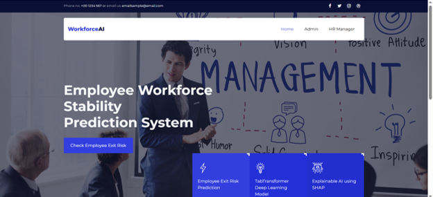
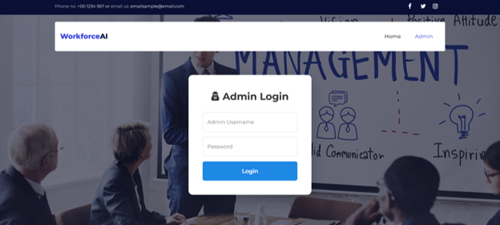
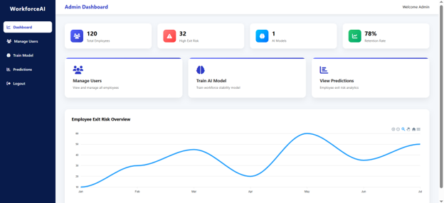
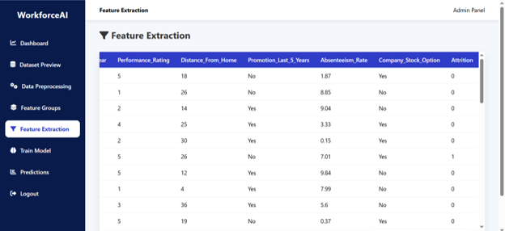
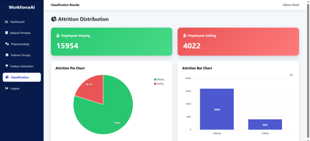

# Employee Turnover Prediction System

## Project Overview

This project is a web-based Employee Turnover Prediction System developed using Python, Flask, Machine Learning, HTML, CSS, JavaScript and MySQL.

The system predicts whether an employee is likely to leave the organization based on employee information such as age, department, salary, experience, job satisfaction and performance rating.

---

## Features

- Employee Login
- HR Manager Login
- Admin Login
- Employee Data Management
- Employee Turnover Prediction
- Machine Learning Model
- Responsive Web Interface

---

## Technologies Used

- Python
- Flask
- HTML
- CSS
- JavaScript
- Bootstrap
- MySQL
- Pandas
- NumPy
- Scikit-learn

---

## Project Structure

Employee-Turnover-Prediction

├── dataset

├── static

├── templates

├── app.py

├── train_model.py

├── requirements.txt

├── model.pkl

├── encoder.pkl

├── scaler.pkl

└── README.md

---

## Installation

Clone the repository

Install dependencies

pip install -r requirements.txt

Run the application

python app.py

---

## Dataset

IBM HR Analytics Employee Attrition Dataset

---

## Future Enhancements

- Improve prediction accuracy
- Deploy on cloud
- Dashboard for HR Analytics
- Real-time prediction

---

## Project Screenshots

### Home Page

### Login Page

### Dashboard

### Prediction Page

### Result Page

---

## Author

Kowsalya.R
B.Tech Graduate
